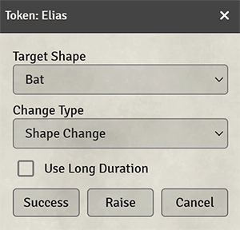
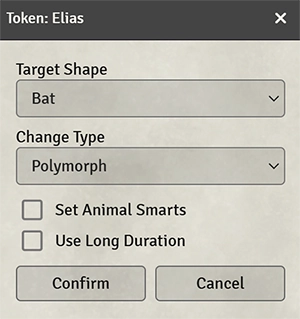

# SWADE Shape Changer

This module for Foundry VTT adds functionality to help automate the shape change power. It handles creating and swapping to a new token and transferring edges, hindrances, attributes, skills, powers, power points, bennies, wounds, and fatigue as described by the Shape Change power. If the token is in a combat, the module also automatically updates the combatant with the new token.

> [!WARNING]
> Due to certain bugs in the swade system, several item sheets and a choice dialog will open during a shape change. As a work around until the system team has a chance to fix it, I'm forcing the windows to close. This means you will see a bunch of windows pop open for a moment before disappearing. This is expected. Please do not enter any issues about this.

> [!TIP]
> If you have the [SUCC module](https://foundryvtt.com/packages/succ) installed with shape change enabled in the Default Conditions settings, the condition will be automatically added and removed when executing shape changes.

## Usage

In order to use the shape change functionality, the actor you want to transform must have the *shape change* power and shapes must be added to the power. From there, it's as simple as selecting the token and executing the Shape Change macro.

#### The Shapes List

When you open the shape change power, you'll see that a new Shapes tab has been added. This tab lists all the shapes that will be available when executing the Shape Change macro. To add new shapes, simply drag an actor from the Actors tab and drop it on the sheet. You can also do this by dragging actors to the actor sheet. This can be done by either the GM or the player if they have the correct permissions. It is fully supported for the GM to add actors to this list that the player does not have any ownership level of.

Clicking on the icon for an entry will open the sheet for that actor. This will still show the sheet even if the player would normally not have permission to view it.

Clicking the trash icon will delete the shape from the list.

#### Change Shape Macro

To trigger a shape change, select the token that you wish to use shape change from. You can optionally select one or more targets (shortcut T by default). If no targets are selected, it will default to targetting the source token. Next click the Change Shape macro (found in the macro compendium for this module) which will display the options dialog. This can be done either by a GM or a trusted player.

    
    

* Target Shape is the shape that you want the target(s) to transform into. This is populated by the list of shapes in the shape change power of the selected token.
* Target Token (if shown) allows you to select which token you wish to target. This option only appears if more than one token is targeted.
* Change Type contains a choice of either Shape Change or Polymorph. The only difference between the two is that Shape Change will also increase the Strength and Vigor of the new token on a raise.
* If Set Animal Smarts is checked, the new token will have their Smarts marked as Animal. This option will only appear when Polymorph is selected.
* If Long Duration is checked, the shape change condition will have a duration of 100 rounds (which might as well be infinite). This option will only appear if SUCC support is enabled.
* Finally, the Success and Raise buttons confirm the shape change. The only difference between the two is that a raise will also increase the Strength and Vigor of the new token. These buttons will only be visible when Shape Change is selected; they will be replaced with a Confirm button when Polymorph is selected.

#### Revert Shape Macro

To revert back to the original shape, select the transformed token and execute the Revert Shape macro (found in the macro compendium for this module). This will swap back to the original token and will update the bennies, wounds, and fatigue of the original token to match the transformed token.

## Feedback

Suggestions and feedback are appreciated. You can contact me on Discord at thechemist30 if you have any questions or comments.

To report a bug, please open a new issue [in the tracker](https://github.com/ddbrown30/swade-shape-changer/issues) or use the [Bug Reporter module](https://www.foundryvtt-hub.com/package/bug-reporter/)
